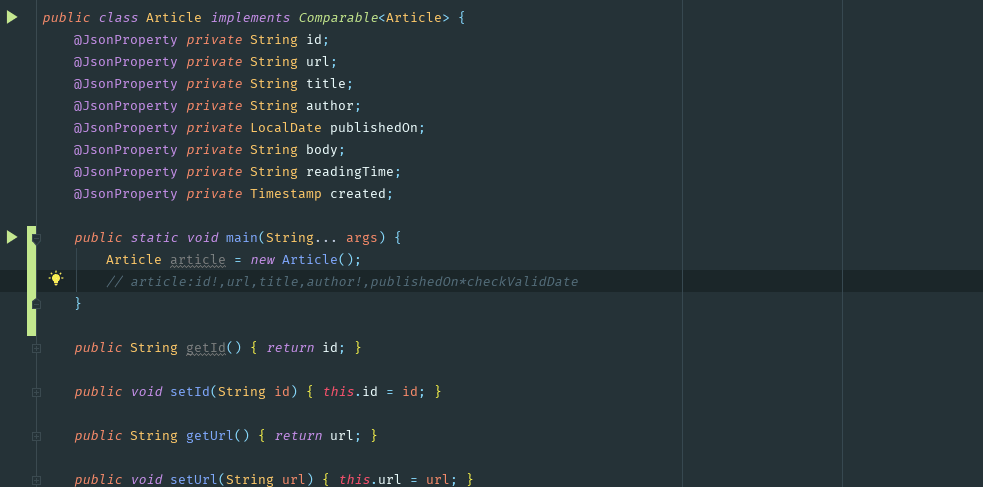

Gensett Plugin for IntelliJ IDEA 
===

This plugin expands shorthand for setter method calls or assignment statements,
so you don't have to write them manually. 

Within an IntelliJ IDEA editor, just press `Ctrl + Alt + ;`  on the line with the expression.
It also adds a `Gensett: Setters/assignments` to the `Generate` menu when the plugin is installed.

See it in action below



## Installation

Install the [plugin](https://plugins.jetbrains.com/plugin/13064-gensett) from the Plugin Marketplace; search for `Gensett`.

Alternatively, you can download the JAR [here](https://github.com/nndi-oss/intellij-gensett/releases).
Install it by going to the `Settings > Plugins > Install Plugin from Disk...`

## USAGE

### The Shorthand

The shorthand is written as a comment with the object instance name and the fields
you want the setter/assignment statements generated for.

* `// <obj>:<fields>` - Expands to Setter method calls
* `// set:<obj>:<fields>` - Expands to Setter method calls
* `// setf:<obj>:<fields>` - Expands to assignment statements on an object 

```java
public class Main {
    public static void main(String... args) {
        Person person = new Person();

        // person:firstName,lastName 
        // ^ press `Ctrl + Alt + ;` on the line above to get the output below _
        person.setFirstName(/* TODO: set it! */);
        person.setLastName(/* TODO: set it! */);

        // setf:person:age,otherThing
        person.age = /* TODO: set it! */;
        person.otherThing = /* TODO: set it! */;

        // set:person:firstName
        person.setFirstName(/* TODO: set it! */);
        
        // person:lastName,middleName
        person.setLastName(/* TODO: set it! */);
        person.setMiddleName(/* TODO: set it! */);
                
        // Assignment statements on fields
        // setf:person:firstName,lastName,middleName
        person.firstName = /* TODO: set it! */;
        person.lastName = /* TODO: set it! */;
        person.middleName = /* TODO: set it! */;

        // Set directly on fields with require non null
        // setf:person:firstName!, lastName!
        person.firstName = Objects.requireNonNull(/* TODO: set it! */, "firstName");
        person.lastName = Objects.requireNonNull(/* TODO: set it! */, "lastName");
        
        // Set directly on fields with custom method
        // setf:person:middleName*checkNotEmpty
        person.middleName = checkNotEmpty(/* TODO: set it! */);
    }
}
```

## ROADMAP

This stuff will be possible in the near future.

```java
public class Person {
    private String firstName;
    private String maidenName;
    private String lastName;
    
    public static void main(String... args) {
        Person person = new Person();
        // ** Field Inspection **
        // When it's smarter, it will know the fields of the class and be
        // able to set them all using `*`, 
        
        // person:*
        person.setFirstName(/* TODO: set it! */);
        person.setLastName(/* TODO: set it! */);
        person.setMaidenName(/* TODO: set it! */);
                
        // setf:person:*
        person.firstName = /* TODO: set it! */;
        person.lastName = /* TODO: set it! */;
        person.maidenName = /* TODO: set it! */;
        
        // ** Field Inspection with Exclusions **
        // also enable exclusions using !<field>
        // setf:person:*,!lastName
        person.firstName = /* TODO: set it! */;
        person.maidenName = /* TODO: set it! */;
    }
}
```

## Current/Known limitations

* [See #1](https://github.com/nndi-oss/intellij-gensett/issues/1) The plugin currently doesn't read/parse your Java classes, as a result:
    * the generated code is based on whatever you type. Watch out for typos :)
    * It does not actually know about your object instance or it's type.
* Does not support multi-caret selections

## LICENSE

MIT

---

Copyright (c) NNDI